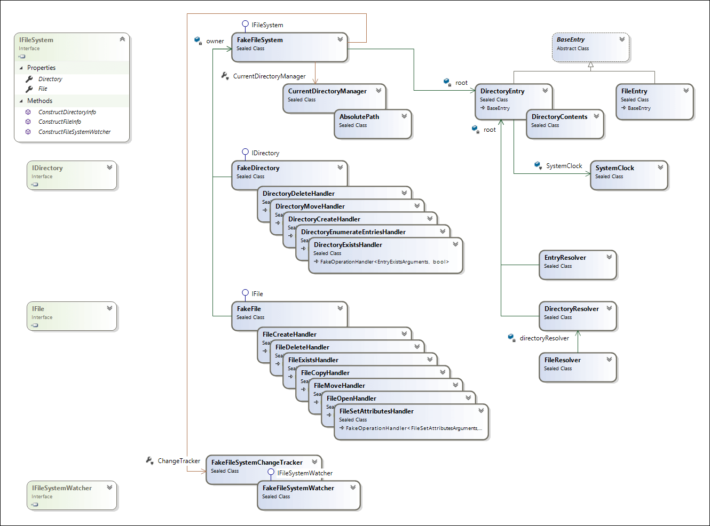

# In-memory file system architecture

If you are interested in how the in-memory file system works, please read on. If you just want to use this library, now is the time to start coding instead! :)

At the deepest level, the in-memory file system stores its files and directories in a tree structure. `FileEntry` contains the metadata and content of a single file. `DirectoryEntry` stores the list of its containing files and subdirectories, by referencing other `FileEntry` and `DirectoryEntry` instances. Both types share a common base class, named `BaseEntry`. It represents common metadata such as name, attributes, creation time, last write and last access time.

`FileEntry` additionally stores its file size and contents, which can be accessed through an `IFileStream` implementation that is returned by its `Open(...)` method. It guards that only a single writer or multiple readers have access to its contents at the same time. Attached stream instances notify their `FileEntry` owner about stream access, so it can update its file times and fire off change notifications.

`DirectoryEntry` provides methods to enumerate its direct contents and to add/remove/rename its files and subdirectories. During these operations, it updates file times and fires off change notifications. `DirectoryEntry` delegates storage of its files and subdirectories to `DirectoryContents`, which provides efficient lookups via caches. It also provides primitive operations like `Add` and `Remove`, assuming all precondition checks have already been run. For example, adding a directory with the same name as an existing file. It only does some last-minute assertions that are expected to never fire.

The root of the tree described above is owned by `FakeFileSystem`. This root entry contains `DirectoryEntry` instances for local drives and network shares. `FakeFileSystem` also exposes a lock object, intended to guard against concurrent operations on the file system. For example, calling `Open()` and `Delete()` for the same file from different threads should run in sequential order, with the last one throwing an exception. Most of the locking is accomplished by facade classes. `FileOperationLocker<TFile>` implements `IFile` and delegates all calls to its private `IFile` instance, but inside the lock to ensure exclusive access. `DirectoryOperationLocker<TDirectory>` works similarly. `FakeFileSystem` exposes `FakeFile` and `FakeDirectory` through these facades. Another important role of `FakeFileSystem` is to resolve paths in string format to normalized absolute paths, taking the current directory into account. It uses `RelativePathConverter` and `CurrentDirectoryManager` to turn path strings into `AbsolutePath` instances.

`AbsolutePath` represents a normalized form without any self- or backreferences like `".\..\documents\file.doc"`. It exposes a collection of components that make up the directory levels. The `GetText()` method reproduces the original path in text form. For example: `"\\?\c:\documents\file.doc  "` (note the trailing whitespace). This is needed when I/O exceptions are thrown that contain the original path string. In contrast, `IsEquivalentTo()` ignores such formatting and casing. Appropriate exceptions are thrown for invalid path characters and reserved names like `"COM1"`. Local paths as well as UNC network shares are allowed.

`FakeFile` and `FakeDirectory` delegate most of their work to separate handlers. For example, `FakeFile.Delete()` uses a `FileDeleteHandler`, passing it an `AbsolutePath` instance. Likewise, `FakeDirectory.Exists` uses a `DirectoryExistsHandler` to delegate its work to.

Handlers perform operation-specific precondition checks. For example, `FileDeleteHandler` throws when trying to delete a read-only file. Each handler receives the root of the `DirectoryEntry` tree during construction. It uses resolvers to traverse the entry tree and locate the node on which a method needs to be called. Some handlers fire off additional change notifications.

Various resolvers exist: one for directories (`DirectoryResolver`), one for files (`FileResolver`) and one for both types (`EntryResolver`). They are reusable tree walkers and expose properties to provide custom exceptions to throw in various cases. Making the exceptions pluggable enables different handler types to throw different exceptions for the same resolve task, depending on the operation being performed. For example, when looking for a file that is missing or exists as a directory. The need for that may seem odd, but it's how things work in the real file system.

File system change notifications are sent to `FakeFileSystemChangeTracker`. It exposes a single event, `FileSystemChanged`, that `FakeFileSystemWatcher` instances subscribe to when constructed. For maximum performance, the event transmits `IPathFormatter` objects instead of `AbsolutePath` objects. This way, path (re)construction is deferred until needed by a watcher. Implementations are `DirectoryEntryPathFormatter`, `FileEntryPathFormatter` and `AbsolutePathFormatter`.

`FakeFileSystemWatcher` uses a producer/consumer queue (`System.Collections.Concurrent.BlockingCollection`) to store change notifications after applying its filters. A background thread sleeps until another queue entry is added and raises change events that external callers can subscribe to. This approach ensures that two event handlers never run concurrently. Each incoming notification is assigned a version number. Once the watcher restarts, the version number is incremented so that old notifications can be flushed from the queue.
