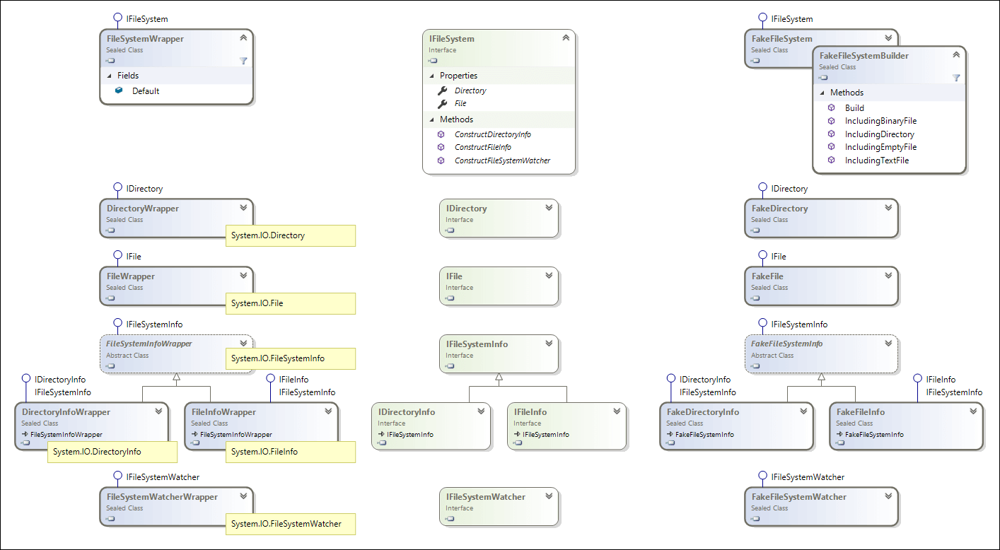

# Overview

This library enables pluggable alternatives to the static types in the `System.IO` namespace. It does so by providing interfaces (middle), along with wrapper implementations (left side) that forward all calls to the static system types. Additionally, an in-memory file system that implements these interfaces (right side) is available.



At the top of the hierarchy is the `IFileSystem` interface.

```csharp
interface IFileSystem
{
	IFile File { get; }
	IDirectory Directory { get; }

	IFileInfo ConstructFileInfo(string fileName);
	IDirectoryInfo ConstructDirectoryInfo(string path);
	IFileSystemWatcher ConstructFileSystemWatcher(string path, string filter);
}
```

It has getters to provide replacements for the static `System.IO.File` and `System.IO.Directory` types. Similarly, construction methods are provided to obtain a replacement for `System.IO.FileInfo`, `System.IO.DirectoryInfo` and `System.IO.FileSystemWatcher`. These replacement interfaces expose the same API as the system types.

Consider the next example:

```csharp
foreach (string filePath in Directory.GetFiles(@"c:\demo"))
{
    FileInfo fileInfo = new FileInfo(filePath);
    Console.WriteLine($"File {fileInfo.Name}: {fileInfo.Length} bytes.");

    string text = File.ReadAllText(filePath);
    Console.WriteLine($"  Content: '{text}'.");
}
```

Minimal changes are needed to use interfaces:

```csharp
IFileSystem fileSystem = FileSystemWrapper.Default;

foreach (string filePath in fileSystem.Directory.GetFiles(@"c:\demo"))
{
    IFileInfo fileInfo = fileSystem.ConstructFileInfo(filePath);
    Console.WriteLine($"File {fileInfo.Name}: {fileInfo.Length} bytes.");

    string text = fileSystem.File.ReadAllText(filePath);
    Console.WriteLine($"  Content: '{text}'.");
}
```

The code above can now be run against the in-memory fake file system:

```csharp
IFileSystem fileSystem = new FakeFileSystemBuilder()
    .IncludingTextFile(@"c:\demo\file1.txt", "Hello!")
    .IncludingTextFile(@"c:\demo\file2.txt", "Other")
    .Build();

// rest of the code unchanged
```

Optionally, `FakeFileSystemBuilder` can be constructed with a `SystemClock` instance to manipulate the system time. For example:

```csharp
var clock = new SystemClock(() => new DateTime(2001, 1, 1));

// Creation date of both files will be set to January 1st, 2001.
IFileSystem fileSystem = new FakeFileSystemBuilder(clock)
    .IncludingTextFile(@"c:\demo\file1.txt", "Hello!")
    .IncludingTextFile(@"c:\demo\file2.txt", "Other")
    .Build();

clock.UtcNow = () => new DateTime(2002, 2, 2);

// Last modified date will be set to February 2st, 2002.
fileSystem.File.AppendAllText(@"c:\demo\file1.txt", "Extra");
```

This should get you started using this library. 

If you're interested in the inner workings of the in-memory file system, you may want to continue reading at: [in-memory file system architecture](Architecture.md).
